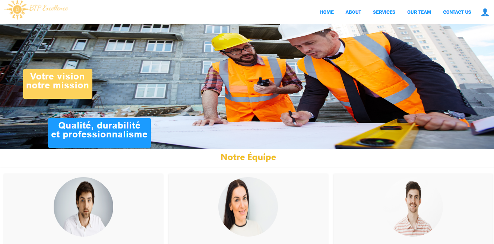

# Projet BTP - Gestion des Services

## Description

Ce projet est une application web développée en PHP pour gérer des **services** dans le domaine du **BTP** (Bâtiment et Travaux Publics).

Elle permet :
- d'afficher les services sur la page d'accueil avec leurs images,
- de gérer ces services via une interface administrateur (ajouter, modifier, supprimer, consulter).

---

## Arborescence du projet

```
.
├── acceuil.php
├── AdminPage.php
├── connexion.php
├── ConsulterSer.php
├── insert.php
├── login.php
├── modif.php
├── modifierService.php
├── Modif_service_form.php
├── style22.css
├── supprimer_Ser.php
├── Supprimer_service.php
├── CSS/
│   ├── Acceuil.css
│   ├── AdminPage.css
│   ├── formulaire.css
│   ├── inserer.css
│   ├── modifier.css
├── DataBase/
│   └── btp.sql
├── images/
│   └── (toutes les images utilisées)
```

---

## Fonctionnalités principales

- **Affichage des services** sur la page d'accueil (récupérés de la base de données avec leurs images).
- **Gestion des services** par l'administrateur :
  - Ajouter un service,
  - Modifier un service,
  - Supprimer un service,
  - Visualiser tous les services.
- **Authentification des administrateurs** :
  - Connexion sécurisée à l'espace d'administration.
  - Affichage du nom et prénom de l'admin connecté sur la page d'accueil.
- **Gestion des images** :
  - Chaque service peut avoir une image associée (attention aux tailles d'images pour la modification).

---

## Base de données

La base de données se trouve dans le dossier `DataBase/btp.sql` et contient deux tables principales :

- **login** : stocke les comptes des administrateurs.
- **service** : stocke les informations des services (titre, description, image, etc.).

---

## Remarques importantes

- Lors de la modification d'un service, certaines images de grande taille peuvent ne pas être acceptées.  
  ➔ Solution : utiliser une image de taille plus adaptée.
- L'affichage de la liste des services dans l'espace admin peut prendre quelques secondes.

---

## Installation

1. Cloner le projet sur votre machine :
   ```bash
   git clone https://github.com/Omayma77/Projet_BTP
   ```
2. Importer le fichier `btp.sql` dans votre base de données MySQL.
3. Configurer votre serveur local (par exemple avec XAMPP) :
   - Déplacer le projet dans le dossier `htdocs`.
   - S'assurer que les identifiants de connexion à la base de données sont corrects (`connexion.php`).
4. Lancer votre serveur Apache et MySQL.
5. Accéder au projet via :  
   `http://localhost/Projet_BTP/acceuil.php`

---

## Captures d’écran

### 1. Page d'accueil - Liste des services



### 2. Page de connexion Admin


### 3. Interface d'administration 


### 3. Interface d'administration - Liste des services


### 4. Formulaire - Modifier un service


---

## Auteurs

- [Omayma Harchich]

---
